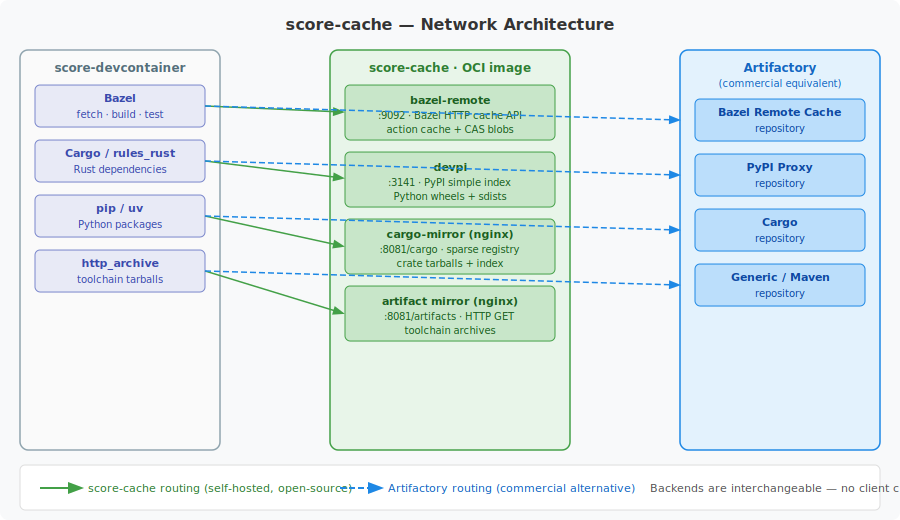
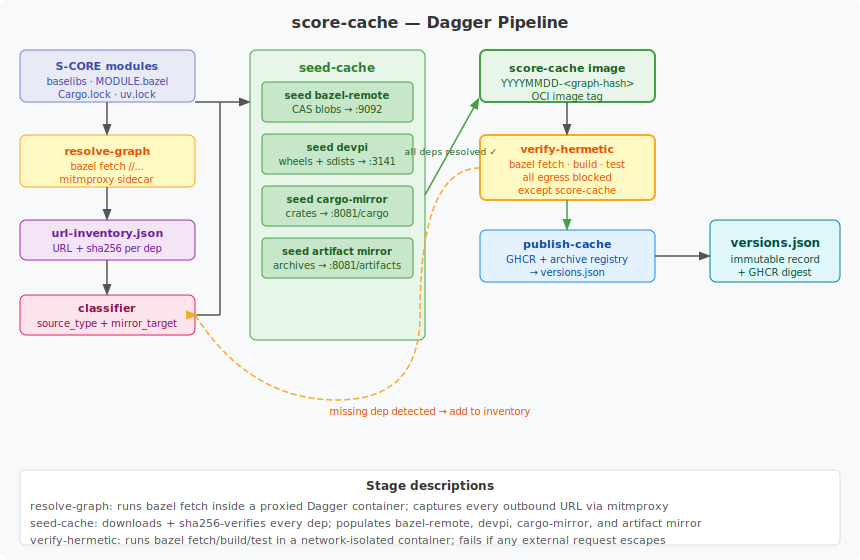

<!-- _class: lead -->

# score-cache

### A hermetic dependency mirror and build cache
#### for the eclipse-score / S-CORE project family

---

# Agenda

1. **The Problem** — why dependency caching matters
2. **What is score-cache** — architecture overview
3. **Services** — four servers, one container
4. **How it is built** — the Dagger pipeline
5. **Why Dagger** — and the benefits for S-CORE
6. **Corporate environments** — replacing with Artifactory / Nexus
7. **Decisions taken** — design choices made
8. **Open decisions** — questions still in flight

---

# The Problem

Commercial builds need reliable, reproducible access to **every** dependency.

**Pain points without a cache:**
- Internet access may be restricted or unavailable (air-gapped CI, devcontainers)
- `bazel fetch //...` contacts dozens of upstream hosts — any outage breaks builds
- Different engineers may resolve different versions (non-hermetic builds)
- No guarantee that a historical image tag can be reproduced months later

**What we want:**
- A single source of truth for all dependencies
- One hostname — `score-cache` — that every tool points at
- Builds that fail loudly if they try to reach the public internet

---

# What is score-cache?

> A self-hosted, hermetic dependency mirror and build cache assembled entirely
> from tools that are already native to the S-CORE toolchain.

<div class="columns">
<div>

**Key properties**
- Single OCI image, four independent servers
- Speaks the exact protocol each build tool expects — no client shims
- Every dependency downloaded once, sha256-verified, and stored
- One pinned version of every dependency per image tag

</div>
<div>

**Open-source alternative to:**
- Artifactory remote cache
- Nexus PyPI proxy
- Cargo sparse registry
- Any generic artifact repo

</div>
</div>

---

# Architecture



---

# Services — four servers, one container

| Service | Port | Protocol | Content |
|---------|------|----------|---------|
| **bazel-remote** | `9092` | Bazel HTTP remote cache API | Action cache + CAS blobs |
| **devpi** | `3141` | PyPI simple index (PEP 503) | Python wheels and sdists |
| **cargo-mirror** (nginx) | `8081/cargo` | Cargo sparse registry | Rust crate tarballs + sparse index |
| **artifact mirror** (nginx) | `8081/artifacts` | HTTP GET | Toolchain tarballs and `http_archive` payloads |

All four services run inside a **single container** managed by `supervisord`.
Each service speaks the exact protocol that the corresponding build tool expects.

---

# Configuring build tools

No client-side shims needed — just point tools at `score-cache`.

<div class="columns">
<div>

**Bazel** (`.bazelrc`)
```ini
build --remote_cache=http://score-cache:9092
build --remote_timeout=60
```

**Python uv** (`pyproject.toml`)
```toml
[[tool.uv.index]]
url     = "http://score-cache:3141/root/pypi/+simple/"
default = true
```

</div>
<div>

**Cargo** (`.cargo/config.toml`)
```toml
[source.crates-io]
replace-with = "score-cache"

[source.score-cache]
registry = "sparse+http://score-cache:8081/cargo/index/"
```

**Docker Compose network** — `score-cache` resolves automatically inside any Dagger service network.

</div>
</div>

---

# Image identity and versioning

Each image is tagged `score-cache:YYYYMMDD-<graph-hash>`.

The `<graph-hash>` is a **deterministic hash** of:
- `.bazelversion`
- `MODULE.bazel` + `MODULE.bazel.lock`
- `uv.lock`
- all `Cargo.lock` files

**Properties:**
- Same inputs → same tag (reproducible)
- Any lock file change → new tag → new image
- Old tags are **never deleted** — historical builds stay reproducible
- `versions.json` records every published digest immutably

---

# The Dagger Pipeline



---

# Pipeline Stages

| Stage | What it does |
|-------|-------------|
| `resolve-graph` | Runs `bazel fetch //...` in a proxied container; extracts every URL + sha256 from the Bazel module lock |
| `seed-cache` | Downloads and sha256-verifies every dependency; populates all four servers |
| `verify-hermetic` | Runs build + test in a network-isolated container — fails if any external request escapes |
| `publish-cache` | Pushes the tagged image to GHCR and an archive registry |
| `record-manifest` | Appends image digests and lock fingerprints to `versions.json` |

```bash
make score-cache-plan   # print execution plan without running
make score-cache-run    # run the full pipeline
```

---

# Why Dagger?

Dagger turns the pipeline into **typed, testable Go/Python functions** that run
identically on a developer laptop and in CI.

| Without Dagger | With Dagger |
|---------------|-------------|
| Shell scripts that break on different OSes | Functions with typed inputs/outputs |
| "Works on my machine" CI failures | Same container engine locally and in CI |
| Hard to test individual pipeline stages | Each function is independently callable |
| Pipeline state leaks between runs | Every function runs in a clean container |

**Why this matters for S-CORE:**
- The `verify-hermetic` gate uses Dagger's service network to completely isolate
  the build — impossible to achieve reliably with shell scripts alone.
- Pipeline functions can be reused across `score/reference-integration` and
  module repositories without copy-pasting shell code.

---

# Dagger Benefits for score and modules

**score/reference-integration**
- Run the full `verify-hermetic` gate against any PR that changes lock files
- Catch missing dependencies before they break CI for downstream consumers
- Reuse the same Dagger functions that build the cache image to verify it

**Dagger modules ecosystem**
- `resolve-graph`, `seed-cache`, and `verify-hermetic` are published as a
  Dagger module — any repo in the S-CORE family can import and call them
- No duplication of pipeline logic across repos
- Version-pin the Dagger module just like any other dependency

**Local developer experience**
```bash
# Same command on laptop and in CI:
dagger call verify-hermetic --source .
```

---

# Corporate Environments — Replacing with Artifactory / Nexus

`score-cache` and Artifactory are **interchangeable** — no client changes needed.

<div class="columns">
<div>

**score-cache endpoint**
```
Bazel: http://score-cache:9092
PyPI:  http://score-cache:3141/...
Cargo: http://score-cache:8081/cargo/...
Files: http://score-cache:8081/artifacts/
```

</div>
<div>

**Artifactory equivalent**
```
Bazel: https://artifactory/bazel
PyPI:  https://artifactory/pypi/simple/
Cargo: https://artifactory/cargo/
Files: https://artifactory/generic/
```

</div>
</div>

**Migration path:**
1. Stand up an Artifactory (or Nexus) instance
2. Seed it with the same inventory extracted by `resolve-graph`
3. Update `.bazelrc`, `pip.conf`, and `.cargo/config.toml` to point at the new host
4. The `verify-hermetic` gate works identically against either backend

---

# Why a Public Cache Container?

In environments **without** a corporate artifact repository:

- **Open-source contributors** working outside corporate networks need the
  same hermetic build guarantee as the internal CI
- **Dagger CI runners** (ephemeral, cloud-hosted) cannot use internal Artifactory
- **Local developer builds** in Docker Desktop, Colima, or Lima all benefit from
  a single shared cache that requires no cloud account or VPN

`score-cache` fills this gap with a single `docker pull` + `docker run` command.

**Corporate migration is always available:** once an organization has an
Artifactory or Nexus instance, they simply point the four config lines at their
instance. The `score-cache` image continues to be used for open-source
contributors and ephemeral CI.

---

# Decisions Taken

| Decision | Choice | Rationale |
|----------|--------|-----------|
| Build orchestration | **Dagger** | Portable, testable, reusable across S-CORE repos |
| Bazel cache server | **bazel-remote** | De-facto standard; speaks native Bazel cache API |
| Python mirror | **devpi** | Reference PyPI mirror; speaks PEP 503 natively |
| Rust mirror | **nginx + sparse index** | Lightest protocol that Cargo and rules_rust both support |
| Image versioning | **YYYYMMDD-`<graph-hash>`** | Date for human readability; hash for reproducibility |
| Manifest storage | **`versions.json` in source** | Immutable append-only record; no database needed |
| Hermetic verification | **Dagger service network** | Reliable egress blocking without host-level network policy |

---

# Open Decisions

| Question | Status | Options |
|----------|--------|---------|
| OCI image sidecar | 🔵 Under review | Add `:5000` distribution endpoint for base images? |
| Cargo index protocol | 🔵 Under review | Stay with sparse index, or switch to git registry? |
| Archive retention policy | 🔵 Under review | How long to keep old image tags in the archive registry? |
| Module publishing | 🔵 Under review | Publish Dagger functions as a versioned module to dagger.io? |
| Baselibs integration timing | 🟡 Pending | When to land `.bazelrc` lines in `eclipse-score/baselibs`? |
| score-devcontainer tagging | 🟡 Pending | Should `score-devcontainer` share the same `<graph-hash>`? |

---

<!-- _class: lead -->

# Summary

- `score-cache` makes **every S-CORE build hermetic** — no external network access at build time
- **Single OCI image**, four servers, interchangeable with Artifactory/Nexus
- **Dagger pipeline** provides reproducible, testable build automation
- Open-source contributors, CI runners, and corporate environments all benefit
- Migration to Artifactory requires only four config line changes

---

<!-- _class: lead -->

# Links

- **score-cache repository:** https://github.com/nick-hildebrant-etas/score-cache
- **eclipse-score / S-CORE:** https://github.com/eclipse-score
- **Marp** (these slides): https://marp.app
- **Dagger:** https://dagger.io
- **bazel-remote:** https://github.com/buchgr/bazel-remote
- **devpi:** https://devpi.net
